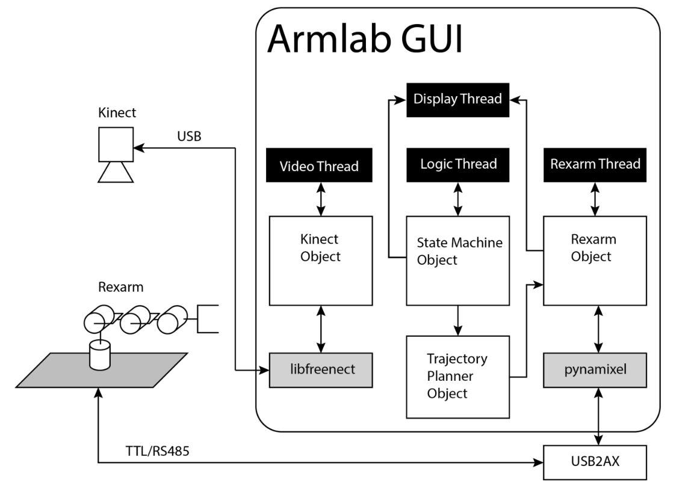
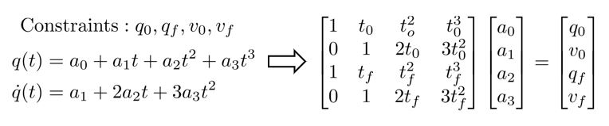
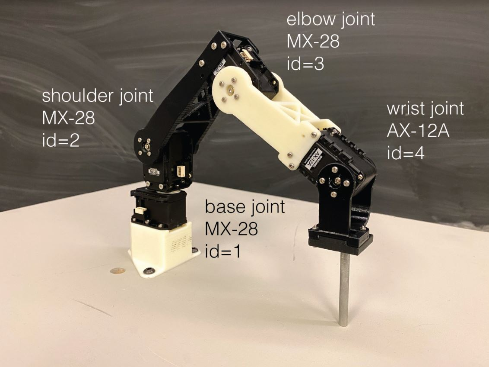

# Rexarm
The Rexarm project is one of three projects I took part in for the Robotic Systems Laboratory course (ROB 550) at the University of Michigan. The objective was to program a 4-DOF robot manipulator that could use an overhead Kinect sensor to move and stack blocks based on color, but due to the COVID-19 pandemic, the project was cut short. Our team was still able to implement a majority of the desired functionality, however, the highlights of which I would like to share here. Thanks to teammates Preeti Kannapan and Niraj Patel for their work on the project.

<u>NOTE 1</u>: While the progression of the project did not start with the Kinect sensor and end with robot kinematics, categorizing them this way is the most digestible.
 
<u>NOTE 2</u>: Due to the early end of the project, I was unable to capture relevant photos or data demonstrating the functionality, so many of these images and equations are taken from the ROB 550 lecture slides.

  

## Part 1: Kinect

The camera component of the project involved calibrating the overhead Kinect camera such that its depth and RGB outputs were aligned, allowing it to detect block shape, color, and height (stack size).

### *Camera Calibration*
The Kinect camera calibration and implementation in the GUI allows the user to mouse over the video feed and be given the pixel location location, as well as corresponding world frame (robot frame) coordinates. To do this, we performed the following:
- Found the affine transformation between the RGB and depth cameras by entering the coordinates of the board corners from both images into ``test_kinect.py``, then stored the result in ``kinect.py``

  

- Used the provided ``util/camera_cal.py`` and a checkerboard in order to find the intrinsic matrix, allowing us to move between the camera frame coordinates and the pixel location in the camera output
- Wrote ``calibrate()`` in ``state_machine.py`` that takes in pixel locations on the board via mouse clicks, then uses ``cv2.solvePnP`` to find the extrinsic matrix that transforms between the camera frame and world frame
  - Stores the result in ``util/extrinsic.npy``, which is loaded by default on startup; ``calibration()`` only called if setup is moved/adjusted

### *Block Detection*
This portion of the project was still being iterated upon, but we were able to get the camera to identify blocks placed in the environment with function ``blockDetector()`` in ``kinect.py``. The process can be described as follows:
- Identify the depth values assigned to the top of blocks, from a stack of 1 to a stack of 5 (note: the way Kinect reads depth values is not directly proportional to actual distance)
- Search for surfaces within a margin of error of those depth values, removing the rest, and filtering the image for noise
- Use shape contours to intialize and store a ``Block`` class variable, which stores the block height, pixel location, world frame location, orientation, and color, used by the robot later to find and grab the block

## Part 2: Robot Manipulator

The robot arm component of the project required the team to generate a sequence of joint positions to move through given a desired final position, as well as implement forward and inverse kinematics to move between Cartesian and joint spaces.

### *Trajectory Planning*
``trajectory_planner.py`` is where we programmed the behavior of the robot when moving between waypoints.
- The team opted to use a cubic spline as the movement profile in order to prevent jerky motion and wear on the motors 
- Given initial and final positions and velocities, we solve for the position equation of each joint, then the max speed dictates the initial and final times

  

- Interpolated positions are fed to the Rexarm in order to replicate the desired trajectory

### *Forward/Inverse Kinematics*

  

The team opted to use Denavit-Hartenberg parameters to implement kinematics, done mostly in ``kinematics.py``.
- Correctly implementing FK was made difficult by the default 0 position of the motors did not match the zero position of the robot, requiring angle displacements to be used as well
- In ``FK_dh()``, homogeneous matrices were generated for each joint using corresponding DH values (stored in ``test_kinematics.py``), and multiplied together to yield the position and orientation of the end effector
- IK solution, written in ``IK_geometric``, was broken down into steps:
  - Use x- and y-coordinates to find the base joint angle, moving the remainder of the problem to 2D
  - Given the desired orientation of the end effector, determining the location of the wrist joint
  - Solving for all four solutions to reach the wrist joint position, then adding necessary wrist joint angle
  

  

### *Next Steps*
Right before the lab was shut down due to COVID-19, the team had an algorithm written for a pick-and-place function that would be commanded by mouse clicks in the GUI. From there, we would use color recognition and the stored ``Block`` variables to have the robot act autonomously based on block color, height, position, etc. That would have set us up nicely for the competition aspect of the project, where teams compete on a series of competency tasks on the last day of the project.
